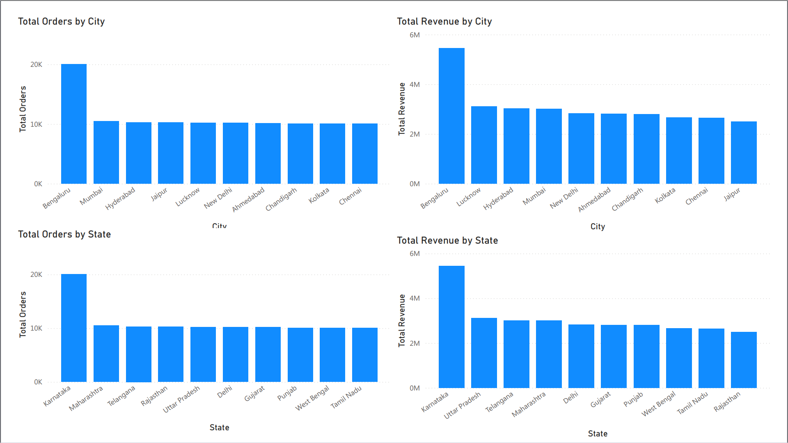

# Swiggy Data Analysis using SQL and Power BI

This project involves analyzing and cleaning the dataset provided by Swiggy. Swiggy is a popular food delivery service in India, and the dataset includes various tables related to food items, menus, orders, order types, restaurants, and users. The goal is to clean the data, format the tables, and store the processed dataset for further analysis.

The Data cleaning in SQL Server included checking null valuesl, empty string, and duplicates, where we found 29 duplicate records. They're deleted with help of the ROW_NUMBER() function. 

Following, 5 dimension tables and 1 fact table were created to reduce data redundancy. The dimension tables contained different informations and derived values for additional insights, whereas the fact table contained the most important business indicators, plus the foreign key columns referencing the primary keys of the dimension tables. 

The distinct entries were inserted into the dimension tables, and the fact table was filled only with the necessary information, along with the foreign keys of the dimension tables.

The business questions were addressed with help of SQL, where we used JOINs, COUNT, SUM, AVG, Aggregations, DATE functions, CASE WHEN, and top performers in various metrics, to answer different KPIs. 

The query results were imported to Power BI for visualization, with help of SQL Statements. These visualizations explain the business requirements using column charts, bar charts, pie charts, and cards, whose results are presented below.

## Timeline-based Analysis:

## Location-based Analysis:

## Category-wise Analysis

## Miscellaneous

